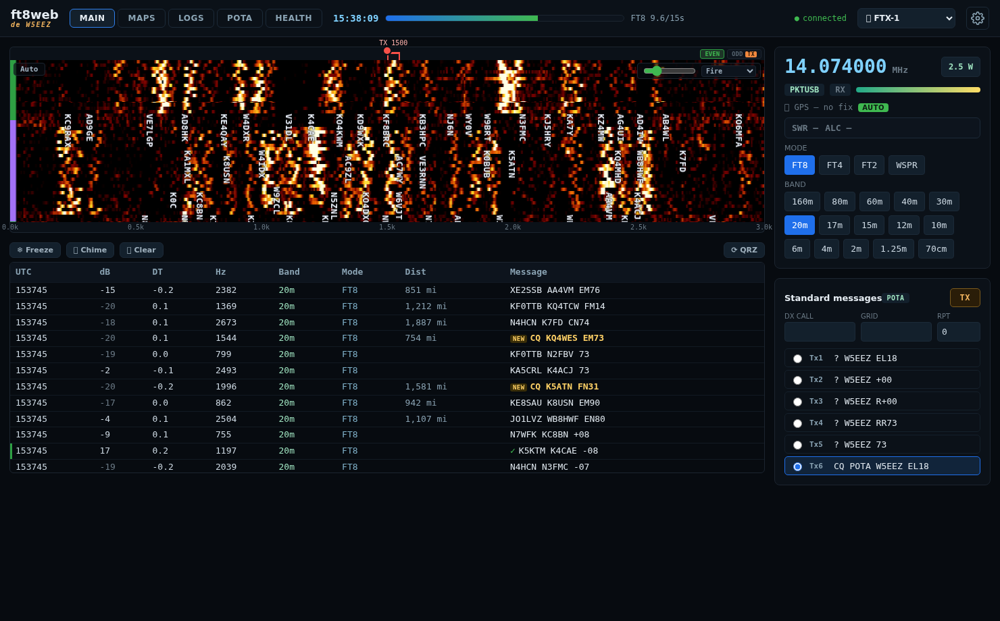
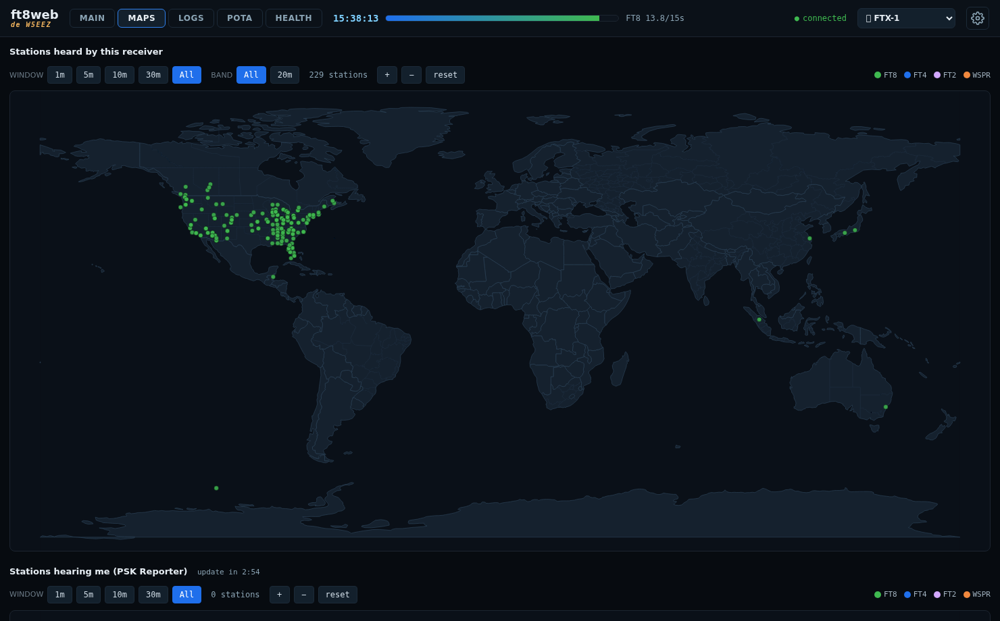
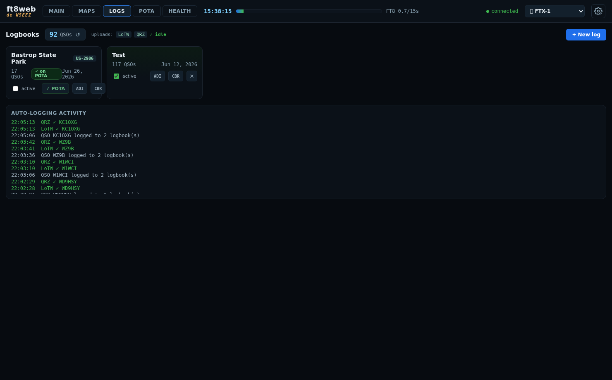
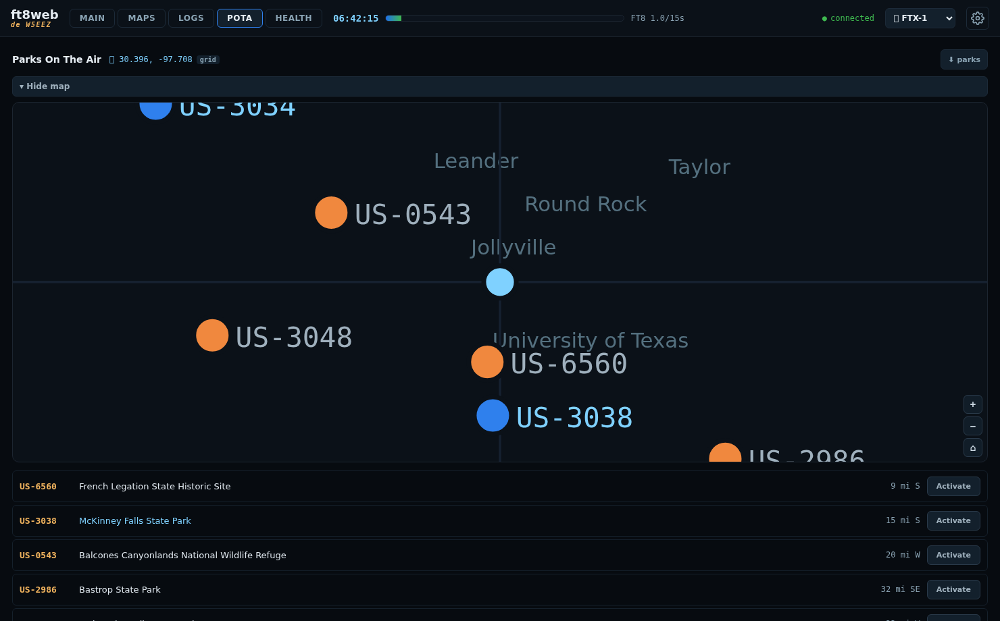
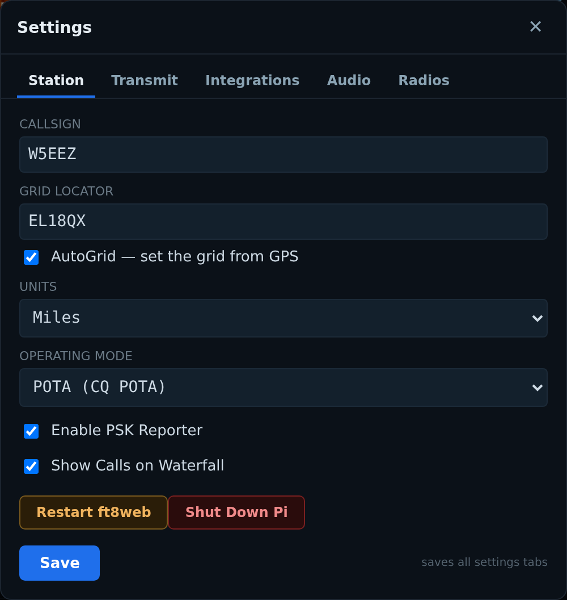
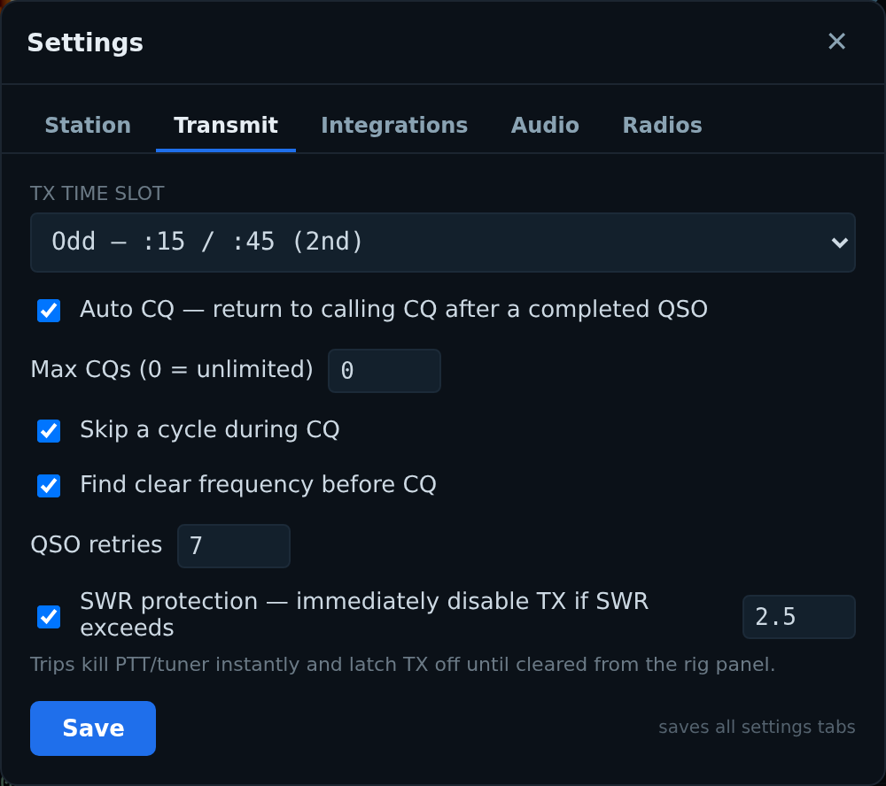
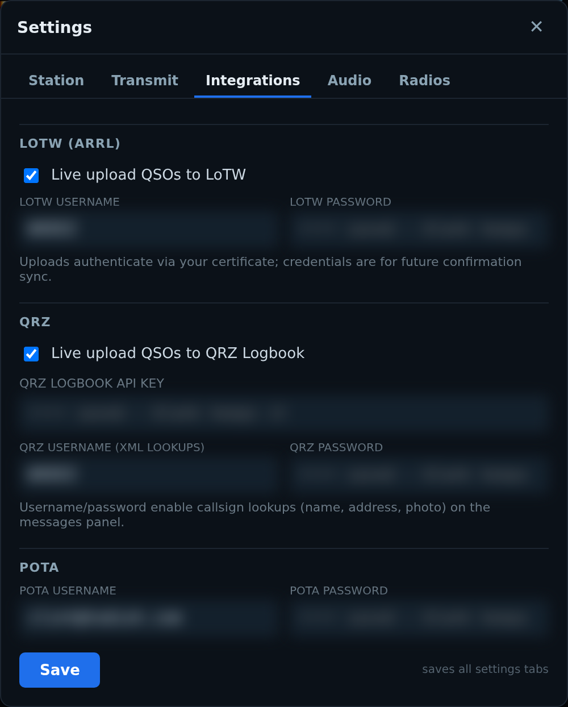
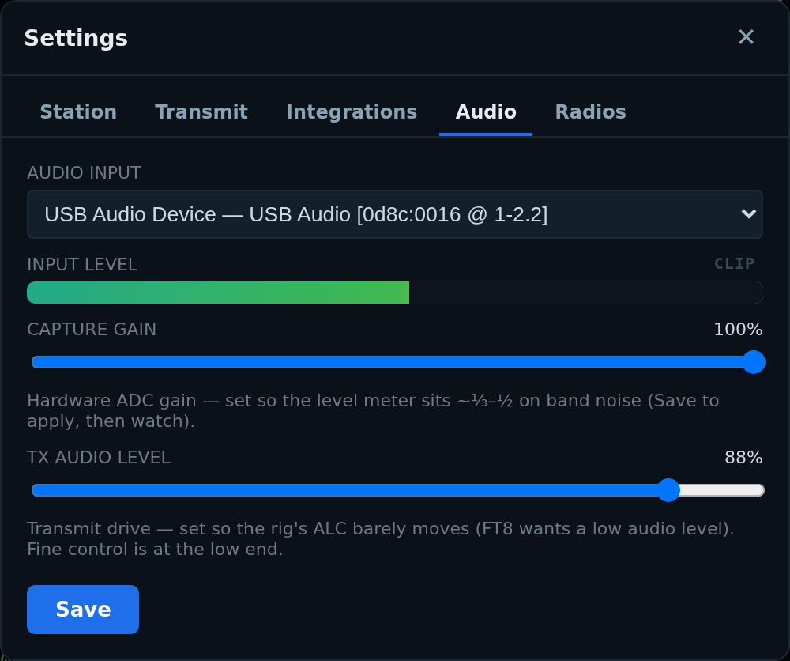
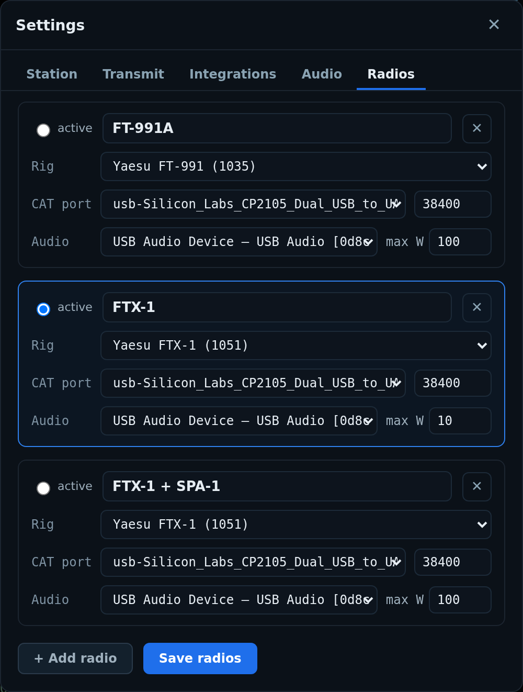

# ft8web

ft8web is a full FT8/FT4/FT2/WSPR web based service that runs on a RPI 5,other SBC or mini-PC and integrates the digital modes, rig control, maps, logging and POTA functions into one UI that can accessed via laptop, phone or tablet. It supports multiple client connections at once so you can start on your laptop and move to a phone if you want to do some TOTA (Toilets On The Air). This uses modems from the WSTJ-X-improved project so there is support for FT2 but not well tested as I've only found 1 ever FT2 signal on the air.

This project was built for my personal use and "works for me", ymmv. It works well on a PI5/8GB, it may work on older PIs, I don't know, give it a try. This software actively keys your transmitter and may set your shack or vehicle on fire, use at your own risk.

## Features

- Decodes flagged NEW / BAND / GRID against a mirror of your QRZ logbook
- WSJT-X-style auto-sequencing and auto-logging
- Auto CQ (careful here, POTA rules prohibit it during activations)
- ADIF and Cabrillo logbooks; realtime LoTW and QRZ QSO upload
- POTA: nearby parks, one-tap self-spot, activation log uploads. This supports 2fer/x-fer and logs multiple parks at once.
- PSK Reporter spotting, both directions
- Live S-meter, power, SWR, ALC; SWR protection; browser dead-man switch. If your browser doesn't heartbeat in a 10 second window, TX is disabled.
- Normal, POTA, and Field Day operating modes; multiple radio profiles

## Tech

- C++ (Crow) backend
- Angular frontend
- Python for some helpers
- WSJT-X/Improved modems/DSP

Q: Why C++, boomer?
A: My original intention was to directly pull the modems into ft8web but then realized all the DSP is written in Fortran and CBA. The code just spawns encoder/decoder (sim) binaries from WSJT-X. Maybe this will be integrated later? Probably not. Besides, C/C++ is the best language ever created and it's speedy. Fight me.

## Screenshots

| | |
|---|---|
|  |  |
|  | |

### Settings

| | |
|---|---|
|  |  |
|  |  |
|  | |

## Documentation
You need a freshly built 64bit Debian based OS. Trixie on a Pi5 is tested and works. Note, CPU usage on the Pi5 is pretty intensive and you may miss TX cycles on very busy bands, but they will pick up for the next one. One tip here, if you're calling CQ, use the 2nd (odd) timeslot as the 1st one tends to be less congested so you're less likely to miss a TX window.

- [docs/INSTALL.md](docs/INSTALL.md) — install it

You obviously need a working network between the web client and Pi (unless you're using the Pi as a client as well). I use a Starlink Mini as an AP but you could set an AP on the Pi if don't have a mobile broadband solution. Phone or mobile hotspot should probably work. If you're using this at home, just use the Pi ethernet port or wireless to your home SSID. 

A GPS module is highly suggested as the AutoGrid feature is awesome for park activations. If you find a GPS hat with PPS, you could also set up a NTP Stratum 1 clock on the Pi for time sync. Tested and works is the Waveshare LC29H hat.

If you having issues getting things working, find me on Discord @W5EEZ

## Misc

 - Be sure to use the Settings->Station->Shutdown Pi button before unplugging power to avoid corrupting your filesystem
 - If you're having issues with no audio and you're sure you have the correct device selected, try Settings->Station->Restart ft8web and wait a few seconds.

## License

GPLv3 — see [LICENSE](LICENSE). Copyright (C) 2026 Clint Todish, W5EEZ.

Modem DSP: WSJT-X (K1JT and contributors) and WSJT-X Improved (DG2YCB), not affiliated with or endorsed by the WSJT-X authors. CAT: hamlib. Web server: Crow. Map data: [vendor/mapdata/ATTRIBUTION.md](vendor/mapdata/ATTRIBUTION.md).
